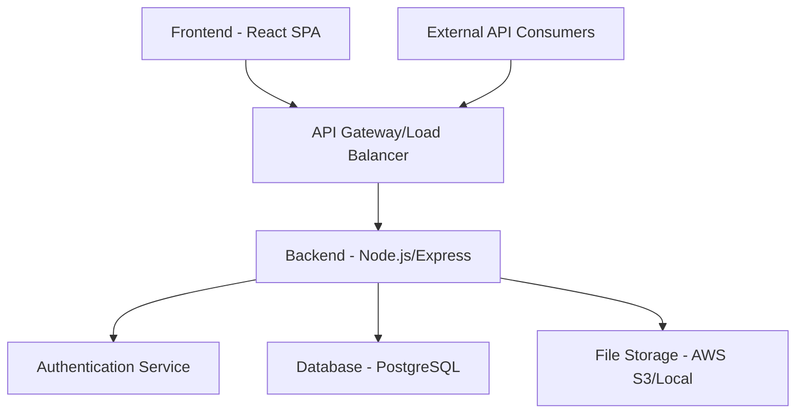

# Design Document

## Overview

The Minecraft griefing group website will be built as a full-stack web application. Here's what that means:

**Full-Stack Application**: This means we're building both the "frontend" (what users see and interact with in their browser) and the "backend" (the server that handles data, authentication, and business logic).

**Frontend (React)**: The user interface that runs in web browsers. React is a popular JavaScript library that makes it easy to build interactive websites. Users will see pages, click buttons, upload images, etc.

**Backend (Node.js/Express)**: The server-side application that handles requests from the frontend. When someone logs in, uploads a photo, or requests data, the backend processes these requests and responds with the appropriate data or actions.

**API (Application Programming Interface)**: A set of endpoints (URLs) that allow other programs or services to interact with your website's data. For example, a Discord bot could use your API to show group statistics.

The system will feature a public website (anyone can view), member authentication (login system), admin capabilities (special permissions for leaders), and a RESTful API (standardized way for other programs to access your data).

## Architecture

### High-Level Architecture



### Technology Stack

**Frontend (What Users See):**
- **React 18 with TypeScript**: React creates the user interface (buttons, forms, pages). TypeScript adds type checking to prevent common programming errors.
- **React Router**: Handles navigation between different pages (like going from homepage to login page)
- **Axios**: Makes requests to your backend API (like "get me the list of members" or "upload this image")
- **Tailwind CSS**: A styling framework that makes your website look good with pre-built design components
- **React Query**: Manages data fetching and caching so your site loads faster

**Backend (Server Logic):**
- **Node.js with Express.js**: Node.js runs JavaScript on the server. Express.js is a framework that makes it easy to handle web requests (like login attempts, file uploads, etc.)
- **TypeScript**: Same as frontend - adds type safety to prevent bugs
- **JWT (JSON Web Tokens)**: A secure way to handle user login sessions. When you log in, you get a token that proves you're authenticated
- **bcrypt**: Encrypts passwords so they're stored securely in the database
- **Multer**: Handles file uploads (like when members upload griefing screenshots)
- **Rate limiting**: Prevents spam by limiting how many requests someone can make per minute

**Database (Data Storage):**
- **PostgreSQL**: A robust database that stores all your data (users, images, posts, etc.)
- **Prisma ORM**: Makes it easier to work with the database using JavaScript instead of raw SQL queries

**Infrastructure (Deployment & Management):**
- **Docker**: Packages your application so it runs consistently anywhere
- **Environment-based configuration**: Different settings for development vs production

## Components and Interfaces

### Frontend Components (Website Pages)

Think of components as individual pages or sections of your website. Each component handles a specific part of the user experience.

#### Public Components (Anyone Can Access)
- **HomePage**: The main landing page visitors see first. Shows group name, description, recent achievements, and member count
- **AboutPage**: Detailed information about your group's history, goals, and notable griefing operations
- **GalleryPage**: A showcase of your best griefing screenshots and videos that you want the public to see
- **LoginPage**: Where group members enter their username and password to access member-only areas

#### Member Components (Login Required)
- **Dashboard**: A personalized homepage for logged-in members showing recent group activity, upcoming plans, and quick access to common actions
- **MemberGallery**: Full access to all griefing content including private screenshots, with ability to upload new content
- **ProfilePage**: Where members can update their information, change passwords, and manage their account settings
- **PlanningBoard**: Coordination tools for planning griefing operations, discussing targets, and organizing group activities

#### Admin Components (Leaders Only)
- **AdminPanel**: Control center for group leaders to manage the entire website
- **MemberManagement**: Add new members, remove inactive ones, change member roles and permissions
- **ContentEditor**: Create announcements, edit group information, and manage what content appears on the public site

### Backend API Endpoints (How Frontend Talks to Backend)

API endpoints are like specific addresses your frontend can "call" to get or send data. Think of them like phone numbers for different services.

**HTTP Methods Explained:**
- **GET**: Ask for data (like "show me the member list")
- **POST**: Send new data (like "create a new member account")
- **PUT**: Update existing data (like "change this member's profile")
- **DELETE**: Remove data (like "delete this member account")

#### Public Endpoints (No Login Required)
```
GET /api/public/info - Get basic group information (name, description, member count)
GET /api/public/stats - Get public statistics (total griefs, featured servers)
GET /api/public/gallery - Get publicly visible screenshots and achievements
```

#### Authentication Endpoints (Login/Logout System)
```
POST /api/auth/login - Submit username/password to log in
POST /api/auth/logout - Log out and invalidate session
POST /api/auth/refresh - Get a new authentication token when the old one expires
```

#### Member Endpoints (Must Be Logged In)
```
GET /api/members/profile - Get your own profile information
PUT /api/members/profile - Update your profile (change password, email, etc.)
GET /api/members/gallery - Get access to all gallery content (including private)
POST /api/members/gallery - Upload new screenshots or videos
```

#### Admin Endpoints (Leaders Only)
```
GET /api/admin/members - Get list of all group members
POST /api/admin/members - Create a new member account
PUT /api/admin/members/:id - Update any member's information
DELETE /api/admin/members/:id - Remove a member from the group
POST /api/admin/content - Create announcements or news posts
```

## Data Models (How Information is Structured)

Data models define the structure of information stored in your database. Think of them as templates that describe what information each type of record contains.

### User Model (Member Information)
This stores information about each person who has an account on your website.

```typescript
interface User {
  id: string;              // Unique identifier for each user
  username: string;        // Display name (like "GriefMaster2024")
  email: string;          // Email address for login and notifications
  passwordHash: string;   // Encrypted password (never store plain passwords!)
  role: 'member' | 'admin' | 'leader';  // What permissions they have
  joinDate: Date;         // When they joined the group
  lastActive: Date;       // Last time they logged in
  isActive: boolean;      // Whether their account is still active
}
```

### GalleryItem Model (Screenshots and Media)
This stores information about each griefing screenshot or video uploaded to your site.

```typescript
interface GalleryItem {
  id: string;             // Unique identifier for each image/video
  title: string;          // Name of the griefing operation
  description: string;    // Details about what happened
  imageUrl: string;       // Where the file is stored
  uploadedBy: string;     // Which member uploaded it
  uploadDate: Date;       // When it was uploaded
  isPublic: boolean;      // Whether visitors can see it (or members-only)
  tags: string[];         // Keywords like ["lava", "TNT", "spawn"]
  serverTarget?: string;  // Which server was griefed (optional)
  participants: string[]; // List of members who participated
}
```

### GroupInfo Model (Overall Group Details)
This stores general information about your griefing group.

```typescript
interface GroupInfo {
  id: string;             // Unique identifier
  name: string;           // Your group's name
  description: string;    // About your group
  foundedDate: Date;      // When the group was created
  memberCount: number;    // How many active members
  totalGriefs: number;    // Total successful operations
  featuredServers: string[]; // Notable servers you've targeted
  lastUpdated: Date;      // When this info was last changed
}
```

### Announcement Model (News and Updates)
This stores news posts and announcements for your group.

```typescript
interface Announcement {
  id: string;           // Unique identifier
  title: string;        // Announcement headline
  content: string;      // Full announcement text
  author: string;       // Who wrote it
  createdDate: Date;    // When it was posted
  isPublic: boolean;    // Whether visitors can see it
  isPinned: boolean;    // Whether it stays at the top of the list
}
```

## Error Handling

### Frontend Error Handling
- Global error boundary for React component errors
- API error interceptors with user-friendly messages
- Form validation with real-time feedback
- Offline state detection and messaging

### Backend Error Handling
- Centralized error middleware
- Structured error responses with consistent format
- Request validation using Joi or similar
- Database error handling with appropriate HTTP status codes

### Error Response Format
```typescript
interface ErrorResponse {
  success: false;
  error: {
    code: string;
    message: string;
    details?: any;
  };
  timestamp: string;
}
```

## Security Considerations

### Authentication & Authorization
- JWT tokens with short expiration times
- Refresh token rotation
- Role-based access control (RBAC)
- Password strength requirements
- Account lockout after failed attempts

### API Security
- Rate limiting per IP and per user
- CORS configuration for allowed origins
- Input sanitization and validation
- SQL injection prevention through ORM
- File upload restrictions (type, size, scanning)

### Data Protection
- Sensitive data encryption at rest
- HTTPS enforcement
- Environment variable management
- Database connection security
- Regular security audits

## Testing Strategy

### Unit Testing
- Backend API endpoints with Jest and Supertest
- Frontend components with React Testing Library
- Database operations with test database
- Utility functions and helpers

### Integration Testing
- API integration tests
- Database integration tests
- Authentication flow testing
- File upload functionality

### End-to-End Testing
- User authentication flows
- Gallery upload and display
- Admin panel operations
- Public website navigation

### Performance Testing
- API response time benchmarks
- Database query optimization
- Frontend bundle size monitoring
- Image loading optimization

## Deployment Strategy

### Development Environment
- Local development with Docker Compose
- Hot reloading for both frontend and backend
- Test database seeding
- Environment variable templates

### Production Considerations
- Container orchestration (Docker)
- Database migrations and backups
- CDN for static assets
- Monitoring and logging
- Automated deployment pipeline